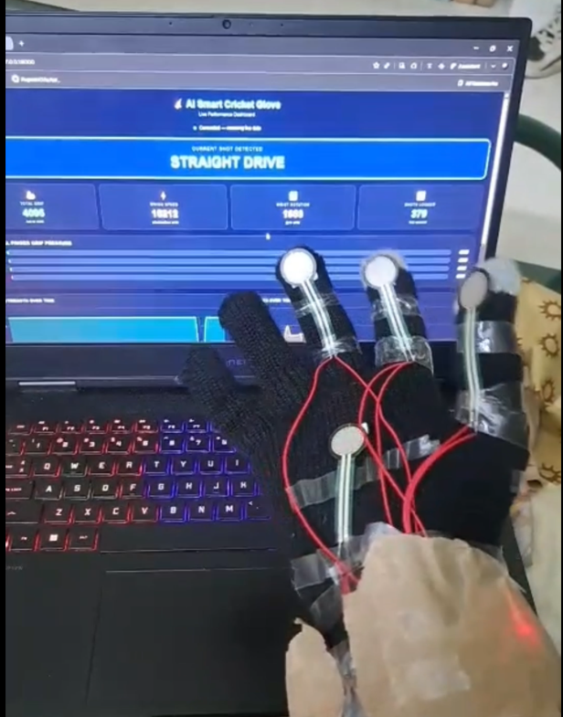
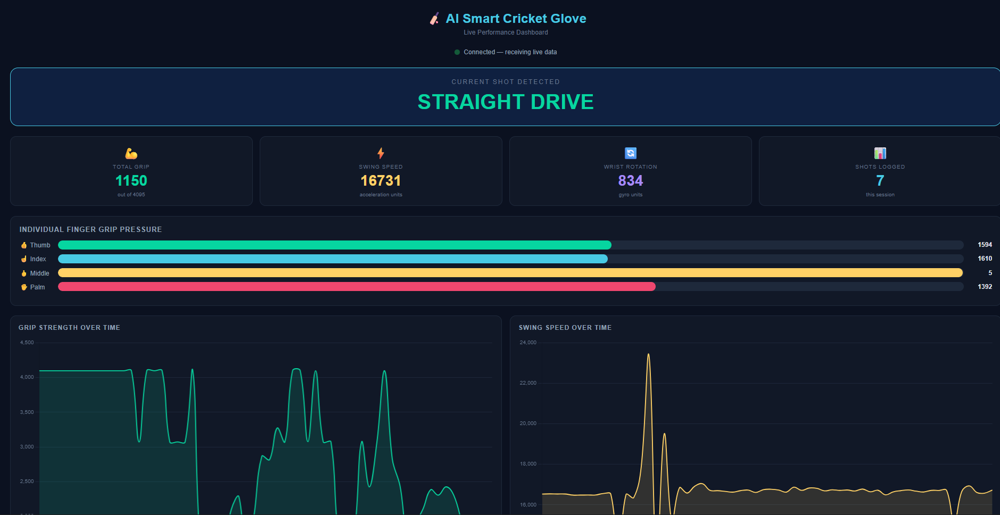
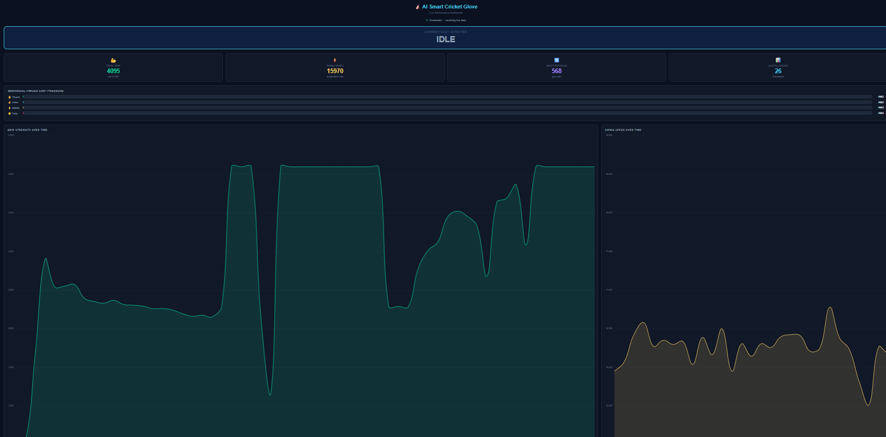
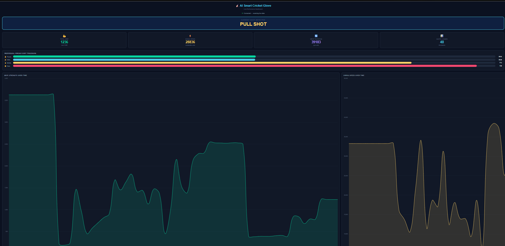
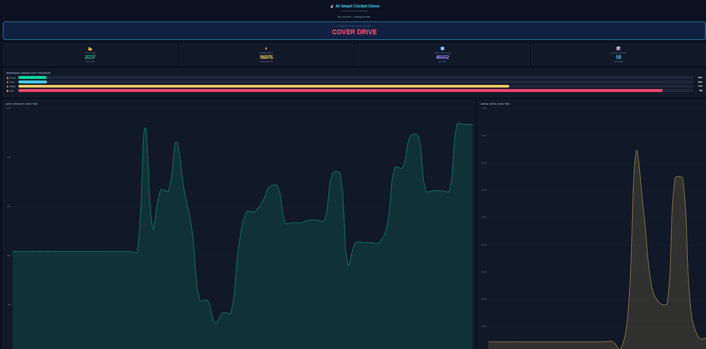

# 🏏 GRIPS — Glove-based Real-time Impact and Pattern System

> An AI-powered wearable cricket analytics platform that combines IoT, Edge AI, Temporal Graph Neural Networks (TGNN), Federated Learning, and Physics-Informed AI to deliver real-time biomechanical shot analysis.

---

# Overview

GRIPS (Glove-based Real-time Impact and Pattern System) is an intelligent wearable sports analytics system designed to classify and analyze cricket batting shots in real time using multi-modal sensor fusion and advanced AI architectures.

The system integrates:

- Smart glove-based force sensing
- Wrist motion tracking
- Real-time edge inference
- Graph-based deep learning
- Federated privacy-preserving AI
- Physics-informed neural regularization
- Interactive performance analytics dashboard

Unlike traditional video-based sports analytics systems, GRIPS captures internal biomechanical signatures such as grip pressure distribution, wrist dynamics, and impact force transitions, enabling highly accurate and explainable cricket shot classification.

---

# Key Features

## Real-Time Cricket Shot Classification
- Detects and classifies 8 distinct cricket batting shots
- Sub-150ms end-to-end inference latency
- AI-powered biomechanical interpretation

## Smart Wearable Glove Architecture
- Multi-zone FSR pressure sensing array
- MPU6050 6-axis inertial measurement unit
- ESP32-C3 edge microcontroller integration
- Lightweight and portable wearable design

## Advanced AI Pipeline
- Temporal Graph Neural Networks (TGNN)
- Graph Attention Networks (GAT)
- GRU-based temporal modeling
- Physics-Informed Neural Networks (PINN)
- Federated Edge Learning (FEL)

## Interactive Analytics Dashboard
- Real-time grip pressure heatmaps
- Swing trajectory visualization
- Shot confidence scoring
- Session analytics and performance tracking
- Biomechanical consistency analysis

## Privacy-Preserving Learning
- Federated training without centralized biometric storage
- Differential privacy-aware model updates
- Edge-first inference architecture

---

# Problem Statement

Cricket batting performance depends on highly complex biomechanical interactions involving:

- Grip pressure distribution
- Wrist orientation
- Swing velocity
- Impact timing
- Finger coordination

Existing cricket analytics solutions primarily rely on:

- Manual coaching observations
- Expensive camera systems
- Video-based computer vision pipelines

These systems fail to capture internal biomechanical patterns such as finger-specific grip pressure and wrist torque.

GRIPS solves this limitation through a wearable AI-driven smart glove capable of real-time multi-modal biomechanical analysis.

---

# System Architecture

## Layer 1 — Sensor Acquisition Layer

The glove integrates:

- 5-zone FSR 402 pressure sensors
- MPU6050 6-axis IMU
- ESP32-C3 Super Mini

Sensor data includes:

- Finger-wise grip pressure
- Angular velocity
- Linear acceleration
- Wrist orientation

---

## Layer 2 — Edge Processing Layer

The ESP32-C3 performs:

- Signal conditioning
- Noise filtering
- Sensor synchronization
- Window segmentation
- Real-time wireless transmission

Data is streamed at 100Hz to the backend inference server.

---

## Layer 3 — AI Inference Engine

### Temporal Graph Neural Network (TGNN)

Models biomechanical relationships between:

- Finger pressure nodes
- Wrist motion dynamics
- Temporal swing evolution

### Federated Edge Learning (FEL)

Enables collaborative learning across devices while preserving player privacy.

### Physics-Informed Neural Network (PINN)

Applies cricket biomechanics constraints during model training to improve reliability and reduce training data requirements.

---

## Layer 4 — Backend Server

Built using Flask and Python.

Responsibilities include:

- Shot-window segmentation
- TGNN inference execution
- API management
- Session logging
- Federated aggregation

---

## Layer 5 — Dashboard Visualization

Interactive web dashboard built with:

- React
- HTML5
- CSS3
- JavaScript
- Chart.js

Provides:

- Live shot classification
- Grip pressure heatmaps
- Swing analytics
- Session performance metrics
- Historical trend analysis

---

# Technologies Used

## AI & Machine Learning
- PyTorch
- PyTorch Geometric
- Temporal Graph Neural Networks (TGNN)
- Graph Attention Networks (GAT)
- GRU Networks
- Federated Learning
- Physics-Informed Neural Networks

## Backend
- Python
- Flask
- REST APIs
- SQLite

## Embedded & IoT
- ESP32-C3
- MPU6050
- FSR 402 Sensors
- Wi-Fi Communication
- Arduino Framework

## Frontend
- React
- HTML5
- CSS3
- JavaScript
- Chart.js

---

# AI Model Highlights

| Feature | Implementation |
|---|---|
| Multi-modal Sensor Fusion | FSR + IMU |
| Graph-based Learning | TGNN + GAT |
| Temporal Modeling | Bi-directional GRU |
| Real-time Inference | <150ms latency |
| Federated Learning | FedProx Aggregation |
| Physics Constraints | PINN Regularization |
| Differential Privacy | Gaussian Noise Injection |

---

# Performance Metrics

| Metric | Result |
|---|---|
| Shot Classification Accuracy | 93.4% |
| Inference Latency | 138ms |
| Shot Detection Recall | 97.3% |
| Supported Shot Types | 8 |
| Wireless Packet Loss | <2% |
| Continuous Battery Runtime | 4+ Hours |

---

# Supported Shot Types

The system classifies:

- Cover Drive
- Straight Drive
- Pull Shot
- Hook Shot
- Cut Shot
- Sweep Shot
- Defensive Block
- Flick Shot

---

# Novel Contributions

- First application of Temporal Graph Neural Networks for wearable cricket analytics
- Real-time graph-based modeling of grip biomechanics
- Physics-informed AI for sports motion classification
- Federated learning for privacy-preserving athlete analytics
- Multi-modal edge AI wearable architecture
- Real-time grip pressure heatmap visualization

---

# 📸 Project Demonstration

## Smart Glove Prototype

  

---

## Real-Time Dashboard — Straight Drive Detection

  

---

## Real-Time Dashboard — Idle State Monitoring

  

---

## Real-Time Dashboard — Pull Shot Detection

  

---

## Real-Time Dashboard — Cover Drive Detection

  

---

## Real-Time Dashboard — Cover Drive Detection

---

# Author

## B Rupesh  
Lead AI Architect & System Integration Engineer  

Email: rupeshbethapudi@gmail.com  
Phone: +91 9493760536
